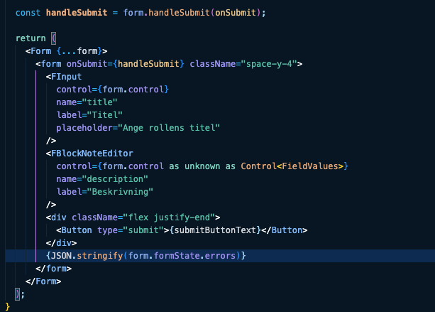

# Limfinity Theme

A sleek, modern dark theme for Visual Studio Code designed with clean syntax highlighting to enhance your coding experience.

## Features

- **Dark Theme**: Easy on the eyes with carefully selected colors
- **Semantic Highlighting**: Enhanced token colorization for better code readability
- **Language Support**: Optimized for popular programming languages
- **Clean UI**: Distraction-free interface with thoughtful contrast

## Screenshots




## Installation

1. Open **Extensions** sidebar in VS Code (`View → Extensions`)
2. Search for `Limfinity`
3. Click **Install**
4. Select **Limfinity Dark** from the menu (`Ctrl+K Ctrl+T` / `⌘K ⌘T`)

## Recommended Settings

```json
{
  "editor.fontFamily": "Your favorite monospace font",
  "editor.fontSize": 14,
  "editor.lineHeight": 24
}
```

## Contributing

Feel free to contribute to this theme by opening issues or submitting pull requests on [GitHub](https://github.com/liminityab/Limfinity).

## License

This theme is released under the MIT License - see the LICENSE file for details.

---

**Enjoy coding with Limfinity!** 